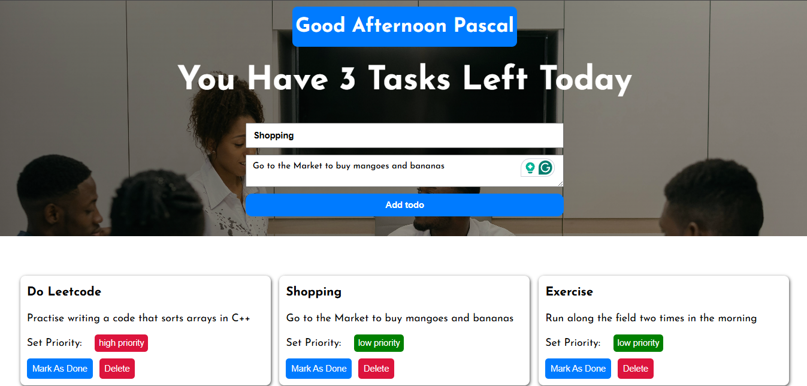

# TASK TRACKER APPLICATION

## Overview

The Task Tracker Applicaion is a web application that helps users efficiently manage their tasks. With features that allow you to set task priorities, 

mark tasks as done, and delete completed tasks, this app is designed to enhance productivity and organization.

## Features

- **Add Tasks**: Quickly add new tasks to your to-do list.
- **Set Priority**: Assign priority levels (High or Low) to each task to help you focus on what’s important.
- **Mark as Done**: Easily mark tasks as completed to track your progress.
- **Delete Tasks**: Remove tasks that are no longer needed or relevant.
- **User -Friendly Interface**: Intuitive design for a seamless user experience.

